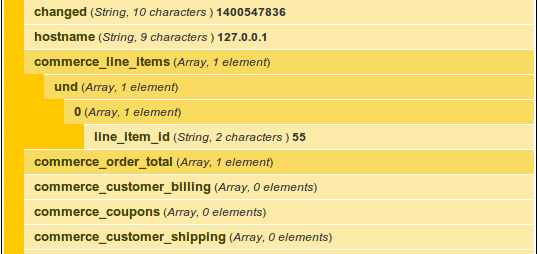

#Welcome to Drupal Commerce

Commerce is a bundle of modules that turns the content management system Drupal into an online store, reservation system, invoicing system, or anything which provides items of monetary value. Commerce provides the bridge of e-commerce and content marketing, bringing a competitive edge to today's online retailers.

Commerce follows the Drupal concept of keeping functionality in a modular fashion. The module itself is made up of eleven different modules, some of which can be used without the other.

{width="wide"}
| Commerce Modules               ||
|-------------|-------------------|
| Cart        | Price             |
| Checkout    | Product Pricing   |
| Customer    | Product           |
| Line Item   | Product Reference |
| Order       | Tax               |
| Payment     |                   |

There are also hundreds of contributed modules which extend Commerce even further. These modules provide shipping capabilities, shipping providers, payment providers, discounts and promotions, enhancements, and more. 

The scope of this book is understand the mechanics that drive the core system.  To unlock the full power of Commerce you must understand the core concepts. The chapters in this book will dive into the fundamentals of each component that makes commerce. There will be use examples, code examples, and code demonstration of the module's API or hooks.

##What makes Commerce
The main Commerce module provides a series of helper functions, such as currency and entity support. These submodules provide a more detailed function to coordinate the overall system. I'll highlight each quickly, but dive into the fundamentals of each later on.

####Cart
The Cart module create a method for customer's to create their own orders by adding products. Cart provides the public end of the order workflow in Commerce. It also provides hooks to allow for product manipulation on products when added to an order or are attached to an order.

####Checkout
The checkout module provides the multiple step form that an order goes through to move from a cart to a completed order. The form is completely customizable with different steps, even allowing for a near single page checkout. The form is built from panes, which are created by other core modules or contributed Commerce modules.

####Customer
Instead of adding fields to users, Commerce utilizes profiles that are fieldable entities. By default these profiles only contain a postal address field provided by the Addressfield module. Profiles are used to in the payment module and contributed shipping module.

####Line Item
The line item module can be considered the backbone of how Commerce operates. When it comes to purchasing products and building orders, line items are the connections that tie it all together. Line items can represent products, fees, shipping charges, discounts, or anything that could be attached to an order.

####Order
The order module is straightforward: it provides the entity that a customer puts products in, moves from a shopping cart to purchased. However, there is much more to the order which will be explained in its chapter.

####Payment
The payment module does not directly provide a method to accept payments. Instead this provides a set of hooks to provide an API to create payment methods. This allows Commerce to integrate with any payment gateway.

####Price
A new field is provided by the price module. This module can be used without any other Commerce component (core?). The price field is an intricate data set which utilizes different price components that calculate the displayed price. Field display formatters provide a robust way of displaying prices.

####Product
What makes Commerce unique, or more so, is how it handles products. The product module provides a new entity that is identified with a SKU. Commerce treats products in the virtual world as we would in the physical world. A blue shirt that comes in medium and large are treated as two different products. This concept will get covered in large detail later on in the modules chapter.

####Product reference
As stated, Commerce treats products directly than other approaches. The predict reference module provides a field that creates a bridge to a product. When this field is attached to nodes, the add to cart form is available. This field also allows line items attached to orders to refer to its original product. The product reference module is integral just as the line item module to how Commerce operates.

####Product Pricing Rules
Following the Commerce way, this module provides a method of altering product prices when viewed through Rules conditions and actions.

####Tax
Tax in Commerce is handled as a price component. Rather than appearing as a line item, or direct price modification, the tax component is wrapped into the line item price. Tax management and flow will be covered in its own section.

##Under the hood
Commerce doesn't rely solely on itself to provide all of the robust functionality. In keeping with the Drupal model, it relies heavily on two modules to help provide its robustness and flexibility. Rules provides the flexibility of custom actions that can be managed through user interfaces. Entities are used heavily within Commerce. Commerce harnesses the power of the Entity API, which extends Drupal core's implementation of entities.

I> ###What are entities?
I> 
I> Entities are data models in Drupal which can have fields attached - such as Nodes and Taxonomy Terms. That means parts of Commerce can have an large variety data and data types associated with it.

I encourage you to learn about these modules and how they work to gain a greater understanding of what makes Commerce. However, each topic could probably have a book of its own! I'll quickly detail them to provide context.

###Rules
There is one part of Commerce that makes it unique and boosts its friendliness to sitebuilders. Instead of solely relying on code and hook implementations or a ground-up user interface, Commerce uses Rules to expose a friendly and dynamic way for users to control the system.

The Rules module is integral to Commerce and is harnessed to power many of its components. Nearly every action provided by Commerce is performed through Rules. Taxes and shipping services are components which are triggered through Rules events and actions. The entire process of an order completing the checkout process is handled through Rules - from marking the order complete, assigning the order to an existing user or creating a new account, and finally sending an order notification to the customer.

###Entities
The other major aspect of Commerce's architecture is its usage of entities. Drupal 7 introduced entities in core, such as nodes and taxonomy terms, that provide a way to attach fields. The contributed entity API module extends the core functionality to make creating and using entities more developer friendly. Commerce utilizes the entity API to power is unique components. Customer profiles, orders, products, and line items are all entities that utilize fields.

Commerce doesn't just use Entity API, it creates a whole new base entity controller. All Commerce entities are created from this new entity controller which extends the base controller provided by Entity API. The core Commerce module provides more granular control over Commerce entities by providing a new controller.

While this adds a level of complexity to how Commerce works, it provides a great method to allowing a flexible framework. By using fields Commerce can adapt to many use cases, such as handling regular product retail, subscription based items, licensing, and even invoicing.

##Developers toolbelt
Brace yourself: you're going to want a nice toolbelt at your side for site building and developing in Drupal Commerce. While you can build a retail store without leaving a user interface, some advanced items will need some code. And whenever you need code and custom modules, you want to know the tips and tricks that could end up saving the day.

#### Devel and Commerce Devel
Many Drupal developers are familiar with the Devel module (http://drupal.org/project/devel.) It provides many debugging tools, one of which is the bundled Krumo debugger. Instead of using `print_r()` and `var_dump()` to debug Drupal's massive arrays and objects, Devel allows you to pass this information to Krumo. Think of Krumo as a clean and interfaceable version of those two functions.

Devel provides two means of debugging: calling its debugging function in code or by viewing an entity's Devel tab. The Devel tab shows the Krumo output of the entity object being views.

The Commerce Devel (http://drupal.org/project/devel) module extends Devel. This provides Devel tab capabilities on Commerce entities and enhancing the debugging environment.

Devel will be your major resource in modifying Commerce and understanding the data being handled.

#### Entity Metadata Wrappers
Entity metadata wrappers are provided by the Entity API module. These wrappers are a way to streamline managing entities and their values. Commerce integrates with the Entity API deep enough to provider robust connections through entity metadata 
wrappers.

Drupal builds out a field with the main field array and Form API values. Inside of that array is the language code for the field's value, sometimes this is 'und' or an actual locale value. Within the language code delta is another array which has the value. In the end you end up with an array looking something like the following:

{lang="php"}
    // Generalizing the local
    $entity['field_name']['und'][0]['#value'];

    // To be proper, you should call LANGUAGE NONE
    $entity['field_name'][LANGUAGE_NONE][0]['#value'];

T> ###Using `LANGUAGE_NONE`
T> 
T> You should use `LANGUAGE_NONE` instead of `und` for best coding practices. However, that is not always the case, especially in inherited projects so both examples are shown. 

Entity metadata wrappers help solve this problem by allowing developers to encapsulate an entity object into a wrapper and utilize defined methods to extract these values. Using a wrapper, the same code above would simply be:

{lang="php"}
    // Create wrapper
    $entity_wrapper = entity_metadata_wrapper($entity_type, $entity);
    // field_name value
    $entity_wrapper->field_name->value();

This book will use entity metadata wrappers when demonstrating manipulation of Commerce entities. Not only does it streamline and simplify management, Commerce implements handlers and methods to ensure proper data manipulation.

To read more on entity metadata wrappers, visit the Drupal.org resource: https://drupal.org/node/1021556

#### EntityFieldQuery()
Entity API doesn't provide all of the power for how contributed module entities work within Drupal. Remember, the Entity API merely extends what Drupal core is lacking, or developers thought Core was lacking.

EntityFieldQuery() is a class that comes with Drupal core and provides a simple way to query the database for entities based on property and field conditions. Properties belong to the actual entity's table within the database. Field conditions allow you to find entities based on field data, such as products that have a specific attribute.

####Commerce Example module
Just as there is the Example module to demonstrate Drupal core's different APIs, there is a Commerce Example module. This book will highlight usage of the APIs but is more concerned of how they're utilized versus code tutorials.

#### Module provided debugging
Not all debugging and utilities come from extra contributed modules. For example, Rules comes with a debugging log. Views provides SQL query and performance information when previewing Views through the administrative UI. All of these items should be used when developing your Commerce site. These insights will provide troubleshooting solutions as well as performance insights.
