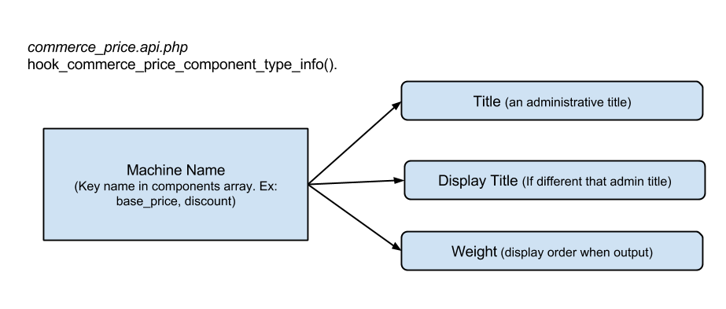
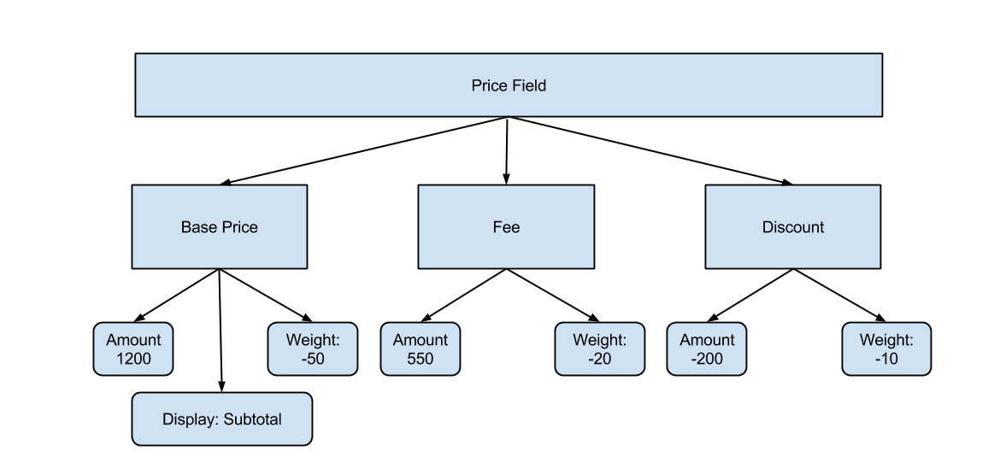

#Understanding price components

Commerce handles pricing as a field on line items and products entities. The field is comprised from a series of price components. The main price component is bar price, provided by the module.

What makes this submodule unique is that it can be used in other use cases outside of a typical Commerce environment. The Commerce price module can be used whenever monetary data had to be handled, especially with multiple currency support. 

Price is handled in a raw non-decimal amount. Different currencies use different formatters to signify the whole dollar amount to partial dollar amount. These currency functions reside within the actual commerce module and is part of the core functionality.

##Rounding of prices
Drupal 7's official requirement for PHP is 5.2.5 with a recommendation for 5.3. Rounding modes were not introduced until 5.3, and even then not all modes found in 5.4 were available. To circumvent compatibility issues, Commerce provides its own method of handling rounding.

    // Define our own rounding constants since we can't depend on PHP 5.3.
    define('COMMERCE_ROUND_NONE', 0);
    define('COMMERCE_ROUND_HALF_UP', 1);
    define('COMMERCE_ROUND_HALF_DOWN', 2);
    define('COMMERCE_ROUND_HALF_EVEN', 3);
    define('COMMERCE_ROUND_HALF_ODD', 4);

These constants mimic those declared by PHP and the `commerce_round()` function acts as the step-in to PHP's `round()`. 

##Currencies
Currency is one of the items defined in the Commerce module itself. Commerce supports multiple currencies, their display format, and conversion. As of Commerce 1.9 there are 147 currencies supported from the ISO 4217 standard. These currencies are defined by the currency code, symbol, name, numeric code (ISO reference), code and symbol placement, minor unit, and major unit.

Currencies are added to Commerce through the `hook_commerce_currency_info()` hook. This allows for new currencies to be added as needed. Taken from `commerce.currency.inc`, here are examples of the US Dollar and Euro:

    // US Dollar
    'USD' => array(
      'code' => 'USD',
      'symbol' => '$',
      'name' => t('United States Dollar'),
      'numeric_code' => '840',
      'symbol_placement' => 'before',
      'code_placement' => 'hidden',
      'minor_unit' => t('Cent'),
      'major_unit' => t('Dollar'),
    ),
    // Euro
    'EUR' => array(
      'code' => 'EUR',
      'symbol' => '€',
      'name' => t('Euro'),
      'thousands_separator' => ' ',
      'decimal_separator' => ',',
      'symbol_placement' => 'after',
      'code_placement' => 'hidden',
      'numeric_code' => '978',
      'minor_unit' => t('Cent'),
      'major_unit' => t('Euro'),
    ),

Currency components contain more available options than the ones listed.The function `commerce_currencies()` invokes the hook to compile all the available currencies. The compiled array of components are then stored in Drupal's static cache when first invoked.

I> ##Drupal's static cache
I>
I> Drupal provides two methods of caching: long term through the database, or short term per bootstrap in static caches. Static caching, called by `drupal_static()` improves performance by giving the module a place to store a compiled array and not having to rebuild it on each invocation. You can learn more through the Drupal API site: https://api.drupal.org/api/drupal/includes%21bootstrap.inc/function/drupal_static/7

If the list of currency components does not exist in Drupal's static cache, it will attempt to load the list from the database cache (unless passed the reset parameter.) If the cache does not exist, or is reset, the currency component arrays are set again in the cache table.

Once the currency components are compiled, it processes each currency and attaches default values to normalize the currency components. The minimum attributes for 

      $defaults = array(
        // Formatting attributes.
        'symbol' => '',
        'minor_unit' => '',
        'decimals' => 2,
        'rounding_step' => 0,
        'thousands_separator' => ',',
        'decimal_separator' => '.',
        'symbol_placement' => 'hidden',
        'symbol_spacer' => ' ',
        'code_placement' => 'after',
        'code_spacer' => ' ',

        // Manipulation callbacks
        'format_callback' => '',
        'conversion_callback' => '',
        'conversion_rate' => 1,
      );

####Formatting Attributes
A single currency may not utilize each attribute, but it does provide the possibility to support any currency. This allows Commerce to be as friendly as possible with internationalization. The minimum requirement for adding  a currency is to provide the currency code and its major unit.

| Overview of formatting attributes                      ||
|---------------------------------------------------------|
|Code                | The ISO 4217 currency code         |
|Symbol              | Symbol that represents the currency|
|Major unit          | The major unit name (ex: Dollar)   |
|Minor unit          | The minor unit name (ex: Center)   |
|Decimals            | How many integers make up the minor unit.|
|Rounding step       | Declare how Commerce should handle round the integer.|
|Thousands separator | Formatting mark to denote the thousands marker. |
|Decimal separator   | Defines how to separator decimals, for example European currencies use "," |
|Symbol placement    | Sets the currency's symbol placement: before, after, or hidden. |
|Symbol spacer       | Defaults to a space.               |
|Code Placement      | Same as symbol placement, provides control of the ISO 4217 currency code: before, after, or hidden. |
|Code Spacer         | Same as symbol spacer.             |

Q> ###Currency rounding steps
Q> 
Q> The rounding step allows currencies to define how to handle rounding of price amounts. If no step is specified it is rounded through half up. The code documentation refers to the Swiss Franc which using a rounding step of 0.05. This is the only currency defined in `commerce.currency.inc` with a rounding step.

####Format Callback
As stated previously, Commerce saves numbers as full numeric values, without decimals. A product worth $5.75 would be saved in the database as 575. When the price is viewed it will be formatted by the referenced currency code. Commerce utilizes `commerce_currency_format()` to format a price amount to the specified currency. The formatter callback runs after Commerce creates the decimal version of the price, based on the currency's attributes.

First the price value is converted into a decimal with `commerce_currency_amount_to_decimal()` based on the currency's decimals attribute, to the power of ten. The amount is then divided by its divisors to provide a format decimal amount.

This decimal format is there passed to the custom format callback, or handled by Commerce. If a custom callback is defined `commerce_currency_format()` passes control and exits, expecting the format callback to return the final value.

Covering the creation of format callbacks is outside the scope of this book. We'll just cover how Commerce performs formatting.

The price converted to decimal is then passed through PHP's `number_format` function. Here is the snippet, exploded for readability.

    // Format the price as a number.
    $price = number_format(
      commerce_currency_round(abs($amount), $currency), 
      $currency['decimals'], 
      $currency['decimal_separator'], 
      $currency['thousands_separator']
    );

Number format will turn the decimal amount into more human readable format. The decimal amount is rounded to the currency's specifications. Decimals, decimals separator, and thousands separator are defined in currency components because they are parameters of the `number_format()` function.

Now that the price number has been converted to decimals and formatted it is wrapped with the other currency display options. Commerce handles this by utilizing the `t()` function and its keyword substitution. 

It passes a string to `t()` with replacements for each currency attribute. Attributes with data are placed while others ignored. The function then returns the result, turning 575 to $5.75. 

####Conversion Callback and Rate
Currencies are able to be converted within Commerce to provide multiple currency sales based on the store's default currency. Conversion is handled through `commerce_currency_convert`, but can be overridden through the `conversion_callback` attribute or `conversion_rate` attribute.

Again, writing a custom callback is outside of the scope of this book, as is managing a store that supports multiple currencies. We'll highlight the default conversion function to detail the capabilities baked into Commerce.

By default all currencies have a 1:1 conversion rate. Other modules can exposed a UI to manage these rates.

First, `commerce_currency_convert()` loads the currency referenced and checks if the conversion callback has been overridden. If it has it'll pass control and expect the callback to return the converted price amount. An example would be a module that provides dynamic conversion rates.

The built in calculation takes the current price amount value and multiplies it by the current currency conversion rate and divides it by the target currency's conversion rate.

###Numbers versus Decimals versus Strings
The end result is simple addition of whole numbers that are provided by the price components in the price field. Price components are made up of a title, display title (optional), and a weight setting. Price components do define a price, but rather prices are given a price component. 

##Price Components
GET GRAPHIC OF REAL RECEIPT. REFERENCE. (right aligned?)

Think of a price component as what makes the transaction details at the bottom of a receipt when you leave the grocery store. There is a line for the subtotal prior to any other additions or subtractions. Lets say you bought items that were on sale in-store but also discounted with coupons. There could be one line to signify the subtraction of all discounted costs, or one for each type. Finally, you purchased a few taxable items while at the store and now there is a total tax charged. This is exactly what the price components provide. To break it down further, each of those totals is actually addition of each item in your order’s price component.

Price components can be negative or positive to provide a way of adding fees, taxes, discounts, or coupon promotion redemption. The price module defines the base price component. This is the default comment applied to price fields to store input data. Base price has a weight of -50 and a display title of Subtotal. The negative weight ensures that when a price field is formatter to display component types site users will see Subtotal as the first item, which provides the original prices - just as your receipts do. Commerce Price provides a discount and fee price component type with a weight of 10 and 20 respectively. Out of the box the module provides a way to modify the base price with different components. Discount components are used to catalog negative numeric values and fees positive numeric values to alter the base price.

The above figure uses the predefined price components and how they are attached to and build out a price field. However, the actual data is formatted a bit differently, this chart serves to help visualize how a price is defined in Commerce.

I> ###Use Case: Shipping Discounts
I>
I> Perhaps there is an ecommerce site that provides both product discounts and shipping discounts. To make customers realize what kind of discount they have received a Shipping Discount price component was created. The shipping promotion merely adds a price component of Shipping Discount with the discounted total, as a negative amount, to the shipping line item's price.

This explanation and detail would suffice site builders or developers who are not going to directly modify price components. However, some want to get down and dirty and directly attach price components or manipulate the data. This is useful for programmatically applying discounts, or extracting components and performing operations with them, such as the Tax Reports submodule in the Commerce Reports contributed module. Price components are recursive in nature and one price component can contain multiple components of its own.

The root level of the price field is an array that resembles a price component, but without reference to an existing component. That is because it is the calculated total of all combined price components underneath it. This follows all descending price components: its amount is either the calculated total of its components or has been set manually. 
Note: Setting a price component’s amount that has subcomponents can be overridden when Commerce performs is pricing calculations and field display.

###Handling Price Components
Any module can create a price component. There is a set of hooks that allow for creation and manipulation of the different price components. The information can be discovered in the `commerce_price.api.php` file located within the folder.

First we'll examine `hook_commerce_price_component_type_info`, which adds a new price component to the system. We will create a new price component that allows us to detail shipping discounts.

    /**
     * Implements hook_commerce_price_component_type_info().
     */
    function module_commerce_price_component_type_info() {
      return array(
        'shipping_discount' => array(
          'title' => t('Shipping Discount'),
          'weight' => -15,
        ),
      );
    }

Inside of the Commerce Price module, there is the `commerce_price_component_types()` function that polls all active modules for this hook to create the array of available components. The compiled array of components is then stored in Drupal's static cache.

As you noticed in our example we did not define a display title. In our case "Shipping Discount" works well as a administrative title and display title. Commerce Price does post processing on the array to ensure that each component is normalized.

    // Add default values to the component type definitions.
    foreach ($component_types as $name => &$component_type) {
      $component_type += array(
        'name' => $name,
        'display_title' => $component_type['title'],
        'weight' => 0,
      );
    }

Commerce Price ensures that all price components have a name key, display_title, and weight. Technically a price component could be initiated with just the `title` attribute.

Once the components have been bundled and normalized, other modules have the opportunity to manipulate the array of price components. Before returning the final value, Commerce Price invokes `hook_commerce_price_component_type_info_alter()`. This hook can be very useful when controlling the order total output when utilizing shipping, discounts, and tax. 

Using our shipping discount example, lets say the client wanted the order total summary to be in a specific order. The request asks that the price component details are in the following order: subtotal (base price), discounts, shipping, shipping discounts, tax, then final total. Using the alter hook we could create a function to provide this ordering.

    function module_commerce_price_component_type_info_alter(&$component_types) {
      // Base price is -50
      $component_types['discount']['weight'] = -30;
      $component_types['shipping']['weight'] = -20;
      // We defined our shipping_discount with weight of -15.
      $component_types['tax|wi_sales_tax']['weight'] = 30;
    }

These two simple hooks allow for a dynamic pricing structure. Field formatters control how these components are rendered when viewing a product, line item, or any entity with a price field.

###Adding a Price Component
Price components are complex structures, but the Price module provides a simple way creating a new component, or attach a component to an existing one. The `commerce_price_component_add()` function takes four parameters with one optional one.
* First, a **price** component is passed. This can be an empty array or an existing price component structure.
* The **type** of component, which is the machine name of price component types in the system.
* **Component price** is the price array for the component, as defined by the price field.
* The component passed can be flagged as **included**, to define if the price has been calculated into the overall total yet.
* The optional field involves **adding a base price** automatically if one does not exist. If one does not exist, the passed **price** field will be assumed as the base price.

Invoking `commerce_price_component_add()` merely adds a new component to an existing, or new, price array. You still need to put the components back into the field.

      // Need to add an example
      // Of Adding a price field programmatically.

###Accessing price field data programmatically

      // Need to add an example
      // Of view a price field through an array.

Recommend always accessing a price field through a wrapper, because of `commerce_price_wrapper_value()`.

      // Need to add an example
      // Of view a price field through wrapper.
      // Like commerce_price_wrapper_value

##Price Field Formatters

One of the greatest uses of the diverse price components is how they are presented to the end user. Commerce Price provides a few select field display formatters:
* Raw amount
* Formatted amount
* Formatted components

Contributed Commerce modules provide new display formatters, such as Commerce Price Savings Formatter provides a more 
stylistic approach to displaying discounted savings.

####Raw amount
The raw amount formatter is extremely straight forward. The field's raw price amount without currency formatting. If a price was entered in as a decimal amount of 5.75, it will be displayed as 575.

####Formatted amount
The formatted amount display formatter will display the price in the specified currency of the price.

####Formatted amount, with components
Creates a table highlighting each component. Each component is detailed as a row with it's label in the first column and formatted price in the second column.

For example, if a product had a discount price component attached it would display as:

| Subtotal | $5.75 |
| Discount | $2.00 |
| Price    | $3.75 |

This formatter also provides `hook_commerce_price_formatted_components()`. Commmerce Price invokes this hook after the components have been compiled and sorted. This allows other module's to interact with the display price components within the table - such as removing or resorting.

###Altering prices before view
Commerce Price provides a way to manipulate displayed prices for robust price calculation. This will be covered more in depth in the product pricing module's chapter.

This capability is provided by `hook_commerce_price_field_formatter_prepare_view()` which is an extension of `hook_field_formatter_prepare_view()`. This allows modules to adjust price field displays.

##Rules Integration
As stated in the introductory chapter, Commerce integrates with Rules to provide a large part of its flexibility. Commerce Price provides its content as a data type to rules. This means that price data can be used in Rules conditions seamlessly. 

I> ###Rules is not a dependency
I> 
I> Rules integration is a soft dependency. Rules is not required for Commerce Price, but if Rules is enabled the functionality will become available.

The module provides a price comparison condition. The default "Data comparison" condition only provides two options: "equals" or "is one of." These do not translate well to handling integers, especially when the item is made up of different attributes - amounts and currency codes.

The price comparison condition provides operators proper for comparing integer values: `<, <=, =, >=, >`. Not only does it provide proper comparison operators, it handles currency conversion. If the two prices have different currency values within the price component it will convert and normalize the values before comparison.

Commerce Price does not provide an action for adding, removing, or updating prices. Manipulation of price values by Rules is left up to other modules that provide entities which price fields and components belong to. Why? This way Commerce Price leaves entity and field logic to other modules. This keeps the module lean and without logic bloat.

The Pricing Rules submodule exposes manipulation of price components through Rules conditions and actions, which will be covered in a later chapter.
